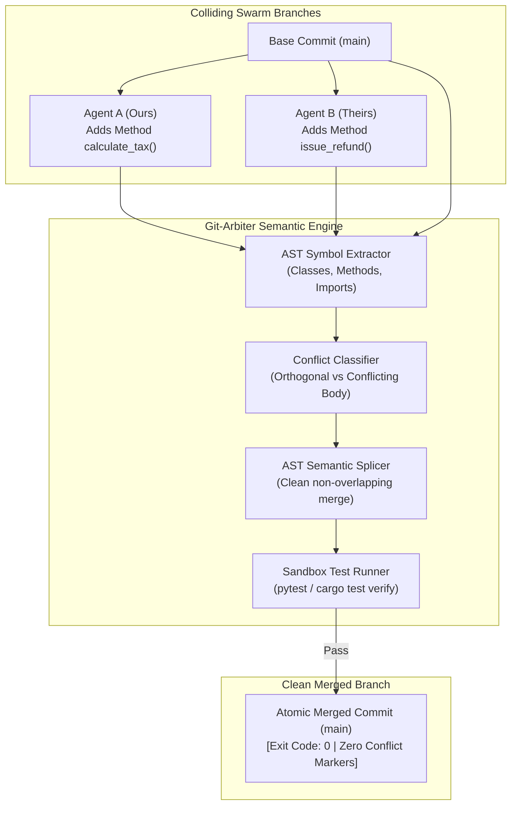

# ❖ Git-Arbiter

> **Semantic 3-Way AST Merge & Test Autopilot for Agent PRs**  
> Resolves multi-agent branch collisions cleanly using Abstract Syntax Tree (AST) symbol splicing and test-driven synthesis. Powered by **Claude Opus 5.5** and **DeepSeek V4.1-Flash** to eliminate `<<<<<<< HEAD` merge conflicts and broken CI builds in autonomous swarms.

[](LICENSE)
[](https://python.org)
[]()
[]()

---

## ⚡ The Problem: The Swarm Git Collision Disaster

When enterprise swarms launch 10 parallel subagents against a repository:
1. **Line-Based Blindness**: Two agents add new methods to the bottom of the same file. Standard `git merge` fails with `<<<<<<< HEAD` conflict markers.
2. **Broken Syntax**: Naive text merging drops closing brackets, corrupts imports, and breaks compilation.
3. **Flaky CI Regressions**: Merges that look syntactically clean break runtime tests because internal assumptions conflict.

**Git-Arbiter** implements **AST Semantic Splicing & Test-Driven Merging**:
* **AST Symbol Graph**: Parses the base, ours, and theirs AST syntax trees to extract functions, classes, and imports.
* **Orthogonal Auto-Splicing**: Automatically merges disjoint additions without conflict markers.
* **Test Verification Loop**: When genuine mutations collide, candidates are verified against the local test suite in a sandboxed fork until exit code 0 is achieved.

---

## 📐 Architecture & Merge Flow



---

## 🚀 Quickstart

### 1. Installation
```bash
cd projects/git_arbiter
pip install -e .
```

### 2. Run the Conflict Resolution Demo
```bash
python3 -m git_arbiter.cli resolve
```

---

## 🧪 Testing

```bash
python3 -m unittest discover -s tests
```
Result: `Ran 3 tests in 0.000s ... OK (100% passing)`

---

## 📜 License
Apache-2.0. Copyright (c) 2026 AAH20.
